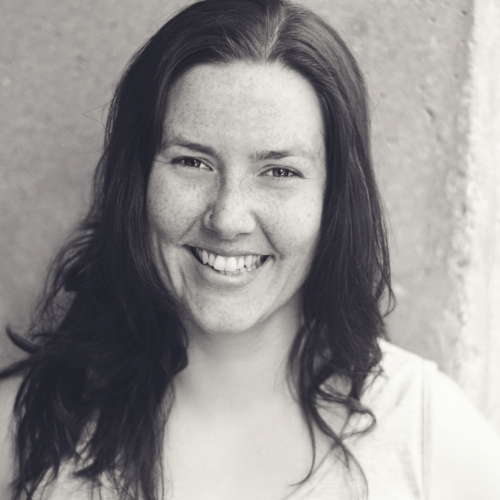
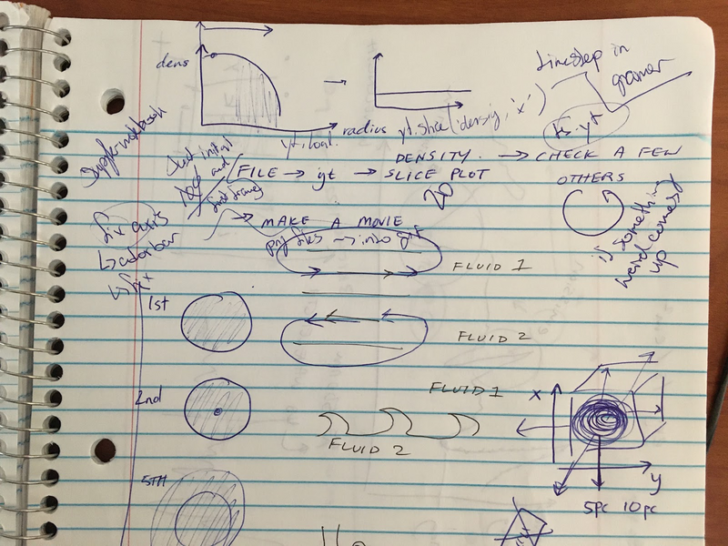
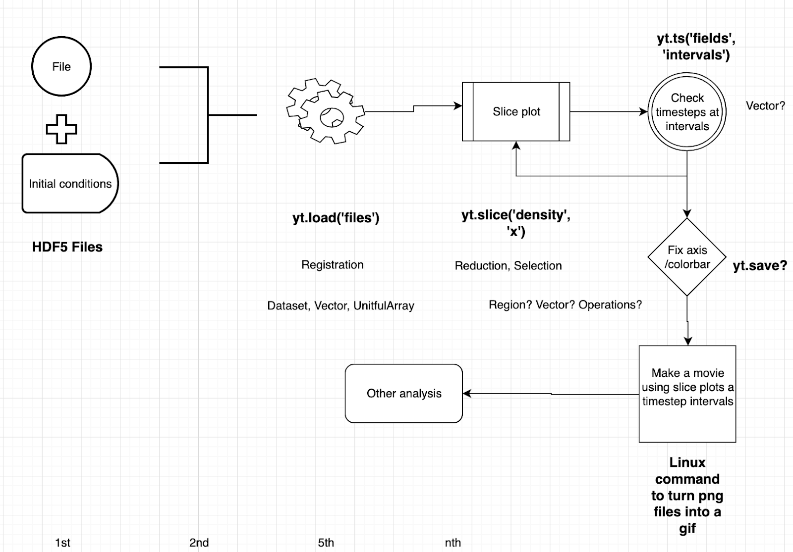
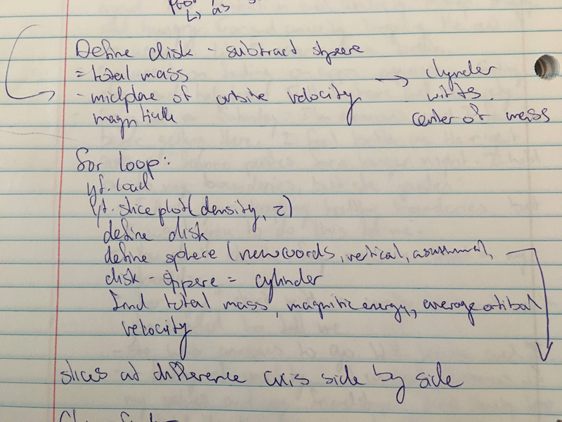

<!-- .slide: class="titleslide" -->

# Data Storytelling and Data Viz

## Matthew Turk

School of Information Sciences 
University of Illinois at Urbana-Champaign 
<tt>mjturk@illinois.edu</tt> 
<tt>matthewturk.github.io</tt>

---

## Thank you

Before I begin, I want to say thank you for inviting me to give this talk today.

I'm really glad I get to meet all of you, and share with you some ideas about
visualization.

---

## Who Am I

<ul>
<li class="fragment">Computational <b>astrophysicist</b> by training</li>
<li class="fragment">Developed simulation platforms and analysis <b>tools</b> for astrophysics</li>
<li class="fragment">Worked in interdisciplinary applications, study <b>communities</b> of practice in open source scientific software</li>
<li class="fragment">Tenure-track at the School of Information Sciences, developing and implementing a <b>grammar</b> of volumetric analysis
</ul>

---

## This Talk

<ul>
<li class="fragment">Why is storytelling important in visualization?</li>
<li class="fragment">How can we apply this?</li>
</ul>

---

## Credits: Local

 <!-- .element: class="headshot" -->

Samantha Walkow <!-- .element: class="headshot-caption" -->

 <!-- .element: class="headshot" -->

Madicken Munk <!-- .element: class="headshot-caption" -->

 <!-- .element: class="headshot" -->

Kacper Kowalik <!-- .element: class="headshot-caption" -->

 <!-- .element: class="headshot" -->

Meagan Lang <!-- .element: class="headshot-caption" -->

 <!-- .element: class="headshot" -->

Jared Coughlin <!-- .element: class="headshot-caption" -->

 <!-- .element: class="headshot" -->

Chris Havlin <!-- .element: class="headshot-caption" -->

---

## Credits: Local

 <!-- .element: class="headshot" -->

Prof. Kate McDowell <!-- .element: class="headshot-caption" -->

 <!-- .element: class="headshot" -->

Dr. Jill Naiman <!-- .element: class="headshot-caption" -->

---

## Let's Center Ourselves

Before we get too far, I want to set the stage for how *I* got here.

(I mean, we're all the protagonists of our own stories, right?)

---

## Cartoon History of the Universe

After recombination, the universe was in a nearly-but-not-totally homogeneous state, seeded with instabilities and with a few residual electrons.

Early-on, dark matter clumps collected and formed "halos," drawing in baryonic material.

This process converted potential energy into thermal energy, heating the baryonic matter, which shed the thermal energy through radiative processes.

Eventually, this cloud becomes fully-molecular through the three-body interaction and forms an accretion disk.

---

## Molecular Hydrogen

$$
\begin{align}
\mathrm{H} + \mathrm{H} + \mathrm{H} & \rightarrow \mathrm{H}_2 + \mathrm{H} \\
\mathrm{H}_2 + \mathrm{H} & \rightarrow \mathrm{H} + \mathrm{H} + \mathrm{H} \\
\mathrm{H}_2 + \mathrm{H} + \mathrm{H} & \rightarrow \mathrm{H}_2 + \mathrm{H}_2 \\
\mathrm{H}_2 + \mathrm{H}_2 & \rightarrow \mathrm{H} + \mathrm{H} + \mathrm{H}_2
\end{align}
$$

In an environment absent heavy elements, the mechanisms by which gas can cool are quite limited.  The principal coolant is molecular hydrogen, which forms first via electron association ($\mathrm{H}^{-}$) and then through three body interactions.

This formation channel results in molecular hydrogen that begins in an excited state.

This molecule then quickly de-excites through collisions, resulting in a net heating of the gas by roughly 4.48 eV per molecule.

---

<h1>We tell lies to visualize.</h1>

<h3 style="text-align:right;">&mdash; Stuart Levy</h3>

---

---

<!--.slide: data-background-image="https://www.nasa.gov/sites/default/files/thumbnails/image/orion-nebula-xlarge_web.jpg" 
            data-background-size="cover" data-background-repeat="none" -->

---

---

<!-- .slide: data-background-image="images/clouds.jpg"
             data-background-size="cover" data-background-repeat="none" -->

---

<!-- .slide: data-background-image="https://upload.wikimedia.org/wikipedia/commons/b/bd/Kelvin_Helmholz_wave_clouds.jpg"
             data-background-size="cover" data-background-repeat="none" class="full" -->

$$\begin{aligned}{\partial \rho  \over \partial t}+\nabla \cdot (\rho \mathbf{v}) &= 0\\
{\frac {\partial \mathbf {v} }{\partial t}}+\mathbf {v} \cdot \nabla \mathbf {v} +{\frac {\nabla p}{\rho }}&=\mathbf {g}\\
{\partial e \over \partial t}+\mathbf {v} \cdot \nabla e+{\frac {p}{\rho }}\nabla \cdot \mathbf {v} &=0\end{aligned}$$

<!--
<a href="https://commons.wikimedia.org/wiki/File:Kelvin_Helmholz_wave_clouds.jpg">Brocken Inaglory [CC BY-SA 4.0], via Wikimedia Commons</a>
 -->

---

$$\begin{aligned}{\partial \rho  \over \partial t}+\nabla \cdot (\rho \mathbf{v}) &= 0\\
{\frac {\partial \mathbf {v} }{\partial t}}+\mathbf {v} \cdot \nabla \mathbf {v} +{\frac {\nabla p}{\rho }}&=\mathbf {g}\\
{\partial e \over \partial t}+\mathbf {v} \cdot \nabla e+{\frac {p}{\rho }}\nabla \cdot \mathbf {v} &=0\end{aligned}$$

---

## But, what do people do?

 <!-- .element: class="headshot" -->

Samantha Walkow has been conducting an investigation into "data storytelling" and how individual researchers describe their process.

Our understanding of the process of visualization, cognition, and semantically-meaningful models will outlast any single tool or platform.<!-- .element: class="fragment" -->

---

<!-- .element: class="storypanel fragment" -->

<!-- .element: class="storypanel fragment" -->

<!-- .element: class="storypanel fragment" -->

<!-- .element: class="storypanel fragment" -->

---

<!-- .element: class="storypanel fragment" -->

<!-- .element: class="storypanel fragment" -->

<!-- .element: class="storypanel fragment" -->

&nbsp;

---

<!-- .element: class="storypanel fragment" -->

<!-- .element: class="storypanel fragment" -->

<!-- .element: class="storypanel fragment" -->

&nbsp;

---

## The Storytelling Triangle

Borrowing from Kate McDowell's framing, we can think of three components in our triangle.

<ul>
<li class="fragment" data-fragment-index="1">The Storyteller</li>
<li class="fragment" data-fragment-index="2">The Tale</li>
<li class="fragment" data-fragment-index="3">The Audience</li>
</ul>

---

## The Storytelling Triangle

Let's think about three potential categories of visualization: <!-- .element: class="fragment" data-fragment-index="1" -->

    

        <ul>
            <li class="fragment" data-fragment-index="2">Visualizations we make for ourselves</li>
            <li class="fragment" data-fragment-index="3">Visualizations we make for our peers</li>
            <li class="fragment" data-fragment-index="4">Visualizations we make for everyone else</li>
        </ul>
    

    

        <ul>
            <li class="fragment" data-fragment-index="2" style="list-style-type:none;">(The Teller)</li>
            <li class="fragment" data-fragment-index="3" style="list-style-type:none;">(The Tale)</li>
            <li class="fragment" data-fragment-index="4" style="list-style-type:none;">(The Told)</li>
        </ul>
    

Each of these brings with it different needs for **narrative**, for
**interactivity**, for **control** and for the **visual language** we use to convey
information.

---

## What is a visualization?

 > Computer-based *visualization* systems provide visual representations of
 > datasets designed to help people carry out tasks more effectively.

Tamara Munzer, <i>Visualization Analysis & Design</i>

---

## What is a visualization?

Data Viz is **task-oriented**.

<!-- .slide: data-background-image="https://www.savalli.us/BIO370/Anatomy/AnatomyImages/TyrannosaurusSkeletonLabel.jpg" data-background-size="auto" -->

---

## What is a visualization?

Artistic representations are used to convey emotions:

<!-- .slide: data-background-image="https://i.etsystatic.com/5150206/r/il/fe175b/1823842266/il_570xN.1823842266_b9y3.jpg" data-background-size="auto" -->

---

## What is a visualization?

Movies, comics, or other cinematic representations are used to tell stories:

<!-- .slide: data-background-image="http://www.dinopit.com/wp-content/uploads/2012/08/funny-dinosaur.jpg" data-background-size="auto" -->

---

# Why?

(Or rather, why _wouldn't_ we visualize?)

---

<iframe width="1024" height="576"
src="https://www.youtube.com/embed/In72QAQJ1tY?rel=0" frameborder="0"
allow="encrypted-media" allowfullscreen></iframe>

---

<!-- .slide: data-background-image="images/fov.svg" data-background-size="contain" -->

---

By Vanessa Ezekowitz [CC BY-SA 3.0](https://creativecommons.org/licenses/by-sa/3.0), via Wikimedia Commons

---

## Your brain does interpolation

<!-- .slide: data-background-image="images/dotsillusion.jpg" data-background-size="auto 50%" -->

There are 12 dots, can you count them all at the same time?

---

## Your brain does interpolation

<!-- .slide: data-background-image="images/blindspotcross.png" data-background-size="auto" -->

1. Look at the cross
2. Close left eye, keep looking at the cross
3. Slowly move your head toward & away from screen until dot disappears

---

## Your brain does interpolation

Even despite these oddities, the visual cortex is great for information transfer!  

Your visual cortex is processing information from different parts of this page **at the same time** -- it can do impressive things very quickly!

---

## Can you spot the difference?

<!-- .slide: data-background-image="https://www.rd.com/wp-content/uploads/2018/01/Can-You-Spot-the-10-Differences-in-This-Picture-_585659516-Ksenya-Savva.jpg" data-background-size="auto 75%" -->

---

## Why visualize?

Visualization **augments** human data analysis capabilities:

 * It enhances our ability to pattern find
 * It allows us to summarize data quickly
 * It allows us to search our data quickly

---

## Anscombe's Quartet

This famous example shows 4 datasets with the exact same mean, variance and correlation coefficient.

Statistics can be useful, but visualization generated context!

---

## Anscombe's Quartet -- Dinosaur Edition

<!-- .slide: data-background-image="https://miro.medium.com/max/600/1*W--cGoA3_n2ZlU6Xs4o2iQ.gif" data-background-size="auto 50%" -->

Statistics can be useful, but visualization generated context!

---

# Who are you visualizing for?

* For yourself?
* For a peer?
* For someone else?

---

# Tenet 1:

"Visualizing data" is not a strict subset of "making an image."

 * Collection of the data
 * Organization of that data
 * Representation of that data

---

# Tenet 2:

We tell lies to visualize, but we _must_ be honest.

 * No representation is going to convey the entire complexity of a dataset.
 * Some representations are better than others.

---

# Tenet 2:

"The Principle of Proportional Ink" -- [callingbullshit.org](https://callingbullshit.org/)
<!-- .slide: data-background-image="images/proportionalInk.png" data-background-size="auto 50%" -->

---

# Tenet 2:

"Spurious Correlations" -- [tylervigen.com](https://tylervigen.com/)

<!-- .slide: data-background-image="images/spurious.png" data-background-size="auto 50%" -->

---

<!-- .slide: data-background-image="images/barCharts.png" data-background-size="contain" -->

---

<!-- .slide: data-background-image="images/gunDeaths.jpg" data-background-size="contain" -->

---

## Data "Framing"

 * Collection
 * Organization
 * Reduction
 * Representation

---

<!-- .slide: data-background-image="images/hearts_battery.svg" data-background-size="contain" -->

---

<!-- .slide: data-background-image="images/hearts_battery.svg" data-background-size="contain" -->

---

<!-- .slide: data-background-image="images/battery.svg" data-background-size="contain" -->

 1. Sensors read the current "fill" of the battery
    * Analog / digital conversion
    * Normalized with respect to expected "full"
 1. This is then scaled to a percentage
 1. The battery image is filled from left to right
 1. The image is then rasterized and displayed

---

<!-- .slide: data-background-image="images/hearts_bw.svg" data-background-size="contain" -->

 * Some fixed maximum amount of damage
 * Each time damage is taken, decrement
 * Each time damage is reversed, increment
 * Display number of hearts as appropriate

---

2 out of 3 "points"

<!-- .slide: data-background-image="images/hearts_color.svg" data-background-size="contain" -->

---

<!-- .slide: data-background-image="images/hearts_color.svg" data-background-size="contain" -->

---

<!-- .slide: data-background-image="images/stitch_bg.png" data-background-size="contain"-->

---

<!-- .slide: data-background-image="images/stitch_nobg.png" data-background-size="contain"-->

---

<!-- .slide: data-background-image="images/stitch_nobg_tilted.png" data-background-size="contain"-->

---

<iframe width="1024" height="576"
src="https://www.youtube.com/embed/D-uBv6jB7r0" frameborder="0"
allow="autoplay; encrypted-media" allowfullscreen></iframe>

---

## Honesty

Our choices must be:

 * Deliberate
 * Informed
 * Motivated
 * Justifiable

---

## Election Maps

Mark Newman of the University of Michigan has created visualizations of the
election maps from several of the most recent elections.  For more information
and context, see his page http://www-personal.umich.edu/~mejn/election/2008/ .

 * [Map 1](http://www-personal.umich.edu/~mejn/election/2008/statemapredbluer1024.png)
 * [Map 2](http://www-personal.umich.edu/~mejn/election/2008/statepopredblue1024.png)
 * [Map 3](http://www-personal.umich.edu/~mejn/election/2008/countymapredbluer1024.png)
 * [Map 4](http://www-personal.umich.edu/~mejn/election/2008/countymappurpler1024.png)
 * [Map 5](http://www-personal.umich.edu/~mejn/election/2008/countycartpurple1024.png)

---

# Our Data Stories

* Character
* Setting
* Plot

As researchers, we can map our data onto these narrative elements.

We must also take into account our role in the presentation; we bring unique motivation, style and methods to our storytelling.

We can codify this in our presentation of our visualizations.

---

# Why are we telling this story?

What is our motivation for presenting this information?  There can be many, and they are not necessarily advertised in the *text* of your tale.  You may find that the three types of story we have described map to one or more of these categories more frequently than others.

What are some reasons and contexts you anticipate telling a data story?

Who might be in your audience?

What is your relationship with them?

---

# Why: Persuasion

Are you leading your audience to a conclusion?  What are some instances in which your primary motivation is to persuade someone of a piece of information?

What are different <i>levels</i> of conclusion that you might want to reach in a research setting?

---
 
# Why: Collaborative Thinking
 
Perhaps your motivation behind telling the tale is to develop a collaborative discussion, and to present it as an unknown.

(Or maybe you just want it to seem like you're collaborating, but really you're leading?)

How might you structure your talk, and choose what you do and do not include?

---

# Why: To Tell a Tale
 
Sometimes telling a tale is just to tell it, to provide voice to information.

Sometimes we tell a tale without knowing <i>why</i> we tell it, at first, and we discover later.

"Maybe the <i>real</i> treasure was the friends we made along the way."

---

# How are we telling the story?

If we define a single piece of information, or a "state" in between transitions (slides, narrative, visual, or otherwise) we can think of how we navigate between those as falling into a few different categories.

This is not a <i>full</i> ontology of how to navigate, but it does touch on a few methods that are approachable.

---

# How: Narrative Progression

The most straightforward approach to telling your data story is to identify a variable, and move along that variable.

Is that variable always time?  What other variables might there be?

Are we moving monotonically?  Do we move at a fixed rate?  How do we ensure adequate information coverage?

---

# How: Expansion of Components

We can *not* present all of the information in a narrative.  But, we can selectively expand on individual components.  For instance, you might choose individual items, "zoom" in on them and [describe them in detail](https://youtu.be/r7Eq3Hr0ehw?t=1595).

We see this with maps pretty often.

What coverage do we want of the items we can present?  How do we choose our illustrative examples, and how is that informed by our motivations?

---

# How: Non-linear Exploration

Perhaps we have no direction for describing -- we have many variables, many directions, or perhaps the variables are not as well defined?

How do you choose what to visit first?  What does 'visiting' an informational node mean in this context?

---

# How: Your Style

How controlling of the narrative process are you?

Are you an auteur, personally influencing not only the presentation but the journey for your audience?

Do you have the opportunity to allow freedom of exploration?  How restrictive?  Where does the technology limit you?

How reliant on appeals to emotion, empathy, relatedness or intuition is your data story?

---

# Wrapping Up

How can we take these different aspects of the "why" and the "how" of our storytelling and construct our stories?

More specifically, how can we identify different *classes* of data that fall easily into these different models?

---

# Thank You

Thank you for this opportunity to talk with you today, and I look forward to
getting to know you folks as you move through the program!

(And if there's any time, let's talk viz tools!)
